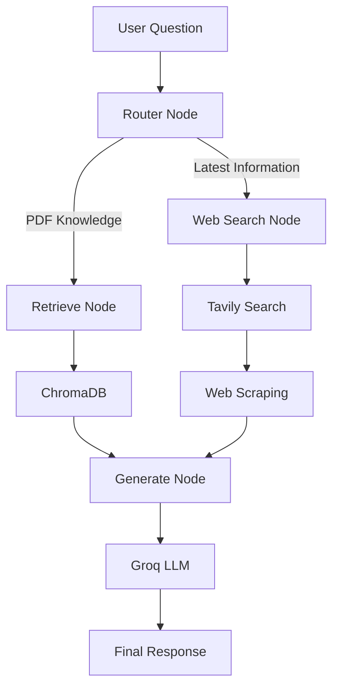
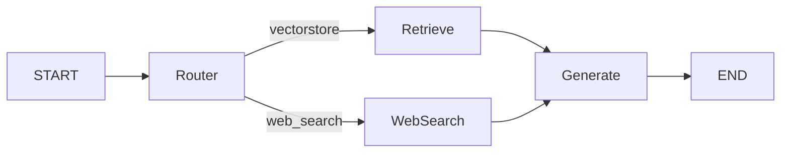

<div align="center">

# 🤖 LangGraph Hybrid RAG Assistant

An agentic Retrieval-Augmented Generation (RAG) system built using LangGraph with intelligent routing between local PDF retrieval and real-time web search.

<br/>


</div>

---

# 📌 Overview

This project is a hybrid RAG assistant built using LangGraph that intelligently routes user queries between:

- 📚 Local PDF knowledge retrieval using ChromaDB
- 🌐 Real-time web search using Tavily

The system uses an LLM-powered router node to determine the best retrieval strategy based on the user's question.

The application supports:
- Semantic PDF retrieval
- Live web search
- Conversational memory
- Source citations
- Persistent vector storage
- Agentic workflow orchestration using LangGraph

---

# ✨ Features

- 🤖 Agentic workflow using LangGraph
- 📚 PDF-based Retrieval-Augmented Generation
- 🌐 Real-time web search using Tavily
- 🧠 Intelligent routing agent
- 💬 Conversational chat interface with Streamlit
- 🗄️ Persistent Chroma vector database
- ⚡ Fast inference using Groq API
- 🔖 Source citations and references
- 🧵 Stateful workflow management
- 🔍 Semantic search using HuggingFace embeddings

---

# 🏗️ Architecture



---

# 🔄 LangGraph Workflow



---

# 🧠 Workflow Explanation

### 🔹 Router Node
The router node uses an LLM to determine whether the query should use:
- Local vector database retrieval
OR
- Real-time web search

---

### 🔹 Retrieve Node
The retrieve node:
- Loads the ChromaDB vector store
- Converts the query into embeddings
- Retrieves semantically similar document chunks

---

### 🔹 Web Search Node
The web search node:
- Uses Tavily Search API
- Searches trusted domains
- Extracts URLs
- Scrapes webpage content using WebBaseLoader

---

### 🔹 Generate Node
The generate node:
- Combines retrieved context
- Sends the context + question to Groq LLM
- Generates the final answer

---

# 🛠️ Tech Stack

- **LangGraph** — Workflow orchestration
- **LangChain** — RAG framework
- **ChromaDB** — Persistent vector database
- **Groq API** — LLM inference
- **Tavily Search** — Real-time web search
- **HuggingFace Embeddings** — Semantic embeddings
- **Streamlit** — Frontend interface
- **Python** — Backend development

---

# 📂 Project Structure

```bash
LangGraph_Project/
│
├── knowledge-base/
│   └── PDFs
│
├── chroma_db/
│
├── main.py
├── pyproject.toml
├── uv.lock
├── .env
├── .gitignore
└── README.md
```

---

# ⚙️ Environment Variables

Create a `.env` file:

```env
GROQ_API_KEY=your_groq_api_key
TAVILY_API_KEY=your_tavily_api_key
```

---

# 🚀 Installation & Setup

## 1️⃣ Clone Repository

```bash
git clone <your-repo-url>
cd LangGraph_Project
```

---

## 2️⃣ Install Dependencies

Using `uv`:

```bash
uv sync
```

---

## 3️⃣ Run the Application

```bash
uv run streamlit run main.py
```

---

# 📚 PDF Ingestion

Place your PDF files inside:

```bash
knowledge-base/
```

Then click:

```text
🔄 Ingest/Re-ingest PDFs
```

inside the Streamlit UI.

---

# 💡 Example Queries

- What are the symptoms of malaria?
- What is the latest WHO malaria report?
- How is malaria prevented?
- Explain malaria treatment methods.

---

# 🔮 Future Improvements

- Multi-agent research workflows
- Reflection-based retrieval
- Query decomposition
- Hybrid search with reranking
- Streaming token responses
- Research report generation
- Multi-document summarization

---

# 📜 License

This project is open-source and available under the MIT License.

---

# 🙌 Acknowledgements

- LangGraph
- LangChain
- Groq
- Tavily
- HuggingFace
- ChromaDB
- Streamlit
